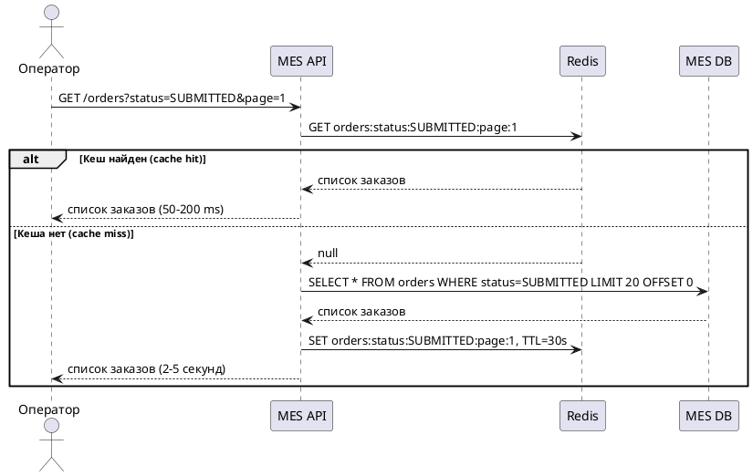
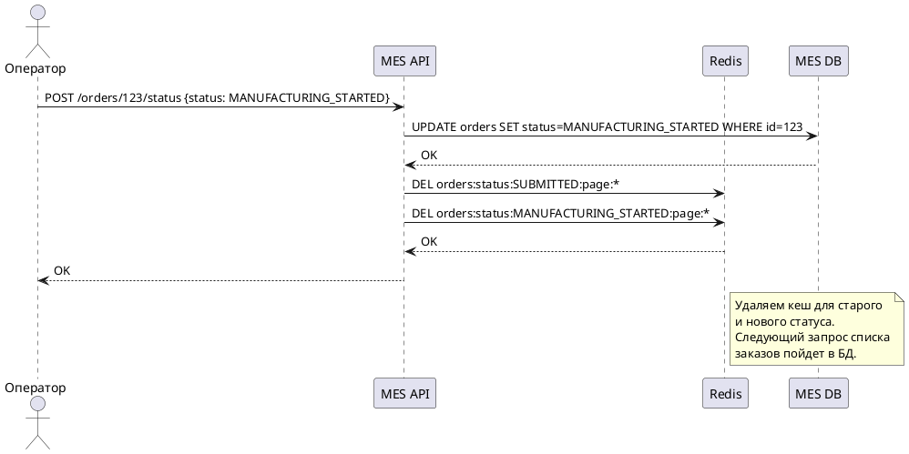

# Архитектурное решение по кешированию

## Анализ системы и выбор части для кеширования

**Анализ диаграммы системы**:

Система состоит из трех API:
- **Shop API** - создание заказов клиентами
- **CRM API** - обработка заказов менеджерами
- **MES API** - производство заказов операторами

**Проблемы**:
1. Операторы жалуются на медленную загрузку первой страницы MES
2. На первой странице - список заказов с фильтром по статусам и пагинацией
3. Проблема усилилась после открытия API

**Что кешировать**:

**MES API - список заказов для операторов**

**Почему именно MES API**:
- Операторы постоянно обновляют страницу, чтобы видеть новые заказы
- Много чтений, мало записей
- Запросы одинаковые - в обновном список заказов по статусам
- Данные меняются не часто (статус заказа меняется раз в несколько минут)

**Почему не Shop API**:
- Каждый клиент создает уникальный заказ
- Нет повторяющихся запросов для кеширования
- Запросы разные у каждого клиента

**Почему не CRM API**:
- Менеджеры работают с конкретными заказами, не со списками
- Меньше нагрузка (меньше пользователей)
- Нет жалоб на производительность

## Мотивация

**Проблема**: MES тормозит, операторы жалуются на низкую скорость

- Операторы жалуются: первая страница MES долго грузится
- На первой странице - список заказов по статусам с фильтром и пагинацией
- Операторам важно видеть самые новые заказы
- Проблема усилилась после открытия API - завалило заказами

**Что тормозит**:
- Список заказов запрашивается из БД при каждом открытии страницы
- С ростом количества заказов (+100 заказов/месяц) запросы стали медленнее
- Фильтр и пагинация помогли, но недостаточно
- Запросы выполняются каждый раз заново, даже если данные не изменились

**Что даст кеширование**:
- Список заказов будет отдаваться из кеша - быстрее в разы
- Снижение нагрузки на БД
- Операторы быстрее видят новые заказы
- Улучшение UX

## Предлагаемое решение

### Технология

**Redis** - кеш для списка заказов
**Yandex CDN** - кэш для статических ресурсов. 

### Клиентское или серверное кеширование

**Серверное кеширование (Redis на стороне MES API)**

**Почему серверное**:
- Список заказов одинаковый для всех операторов - кеш переиспользуется
- Один оператор загрузил страницу → все остальные получают из кеша
- Снижение нагрузки на БД для всех пользователей
- Инвалидация кеша в одном месте - проще управлять

**Почему не клиентское для списка заказов**:
- Кеш в браузере - только для одного оператора, другие не получат выгоду
- Каждый оператор будет делать запрос в БД при первой загрузке
- Нет снижения нагрузки на БД
- Сложнее инвалидировать - нужно сообщать всем клиентам

**Клиентское кеширование для справочных данных**

Для фронтенд-систем (MES, CRM, Shop) можно использовать клиентское кеширование браузера для:
- **Статичных данных**: список статусов, справочники материалов, настройки
- **HTTP-кеширование**: браузер кеширует с помощью заголовков `Cache-Control`, `ETag`

**CDN для статических ресурсов**

Для онлайн-магазина (Shop) можно использовать CDN:
- **Статические файлы**: JS, CSS, изображения товаров, иконки
- **Готовые элементы для конструктора**: библиотека 3D-элементов, из которых клиенты собирают украшения
- **Географическое распределение**: клиенты из разных регионов получают файлы с ближайшего сервера
- **Снижение нагрузки на S3**: меньше запросов к хранилищу

**Важно**: Пользовательские 3D-модели НЕ кладём в CDN - это персональные данные клиентов. Только публичные элементы конструктора.

### Что кешируем

**Список заказов для операторов**:
- Кешируем результат запроса списка заказов с фильтрами
- Ключ кеша: `orders:status:{status}:page:{page}`
- TTL: 30 секунд (операторам важны свежие данные)

### Паттерн кеширования

**Cache-Aside**

**Почему Cache-Aside**:
- Простая реализация
- Данные попадают в кеш только при реальном запросе
- Не нужно заранее прогревать кеш
- Подходит для read-heavy нагрузки

**Почему не Write-Through**:
- При каждом изменении статуса заказа нужно было бы обновлять весь список
- Сложнее реализовать - нужно обновлять кеш при любом изменении
- Больше нагрузка на кеш при записи

**Почему не Refresh-Ahead**:
- Нужно предсказывать какие данные понадобятся - сложно
- Лишняя нагрузка на БД для обновления кеша

### Инвалидация кеша

**Когда инвалидируем**:
- При изменении статуса заказа - удаляем кеш для этого статуса
- При создании нового заказа - удаляем кеш для статуса SUBMITTED
- TTL 30 секунд - кеш обновляется автоматически

### Диаграмма последовательности

**Чтение списка заказов**:

**Изменение статуса заказа**:

